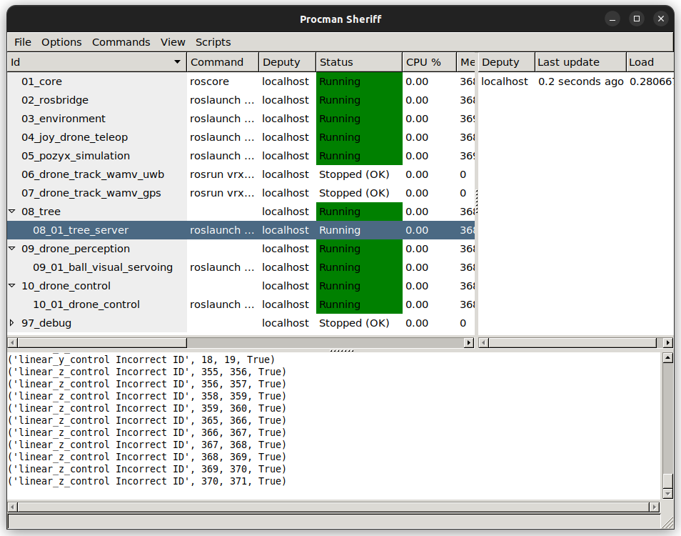

# UAV Tracking USV Demo

## Introduction

There are now two methods for the UAV tracking the USV.
#### 1. DRL using UWB Pose
   
   Given the UWB ranges, then calculate the UAV pose in the USV frame. Then use the DRL to control the UAV to track the USV.

#### 2. Pixhawk using UWB Pose
   
   Given the UWB ranges, then calculate the USV pose in the UAV local origin frame. Then use the Pixhawk (`/mavros/setpoint_position/local`) to control the UAV to track the USV.

#### 3. Pixhawk using GPS only
   
   Given the GPS location of the USV, then use the Pixhawk (`/mavros/setpoint_position/global`) to control the UAV to track the USV.

## Environment Setup

### 1. Clone the repo

```
git clone --recursive git@github.com:ARG-NCTU/robotx-2022.git
```

### 2. Run Docker

```
cd robotx-2022
source ipc_run.sh
```

After start the docker container, please ensure you are in the folder named robotx-2022.

### 3. Build the catkin workspace

This will build the `catkin_ws` and setup `PX4-Autopilot`.

```
source build_all.sh
```

### 4. Setup the environment

```
source scripts/00_setup_all.sh
```

### 5. Launch the simulation

```
make drone_uwb_px4
```



You can press `ctrl+s` to start the processes.

3. 03_environment: This will launch the gazebo simulation.
4. 04_joy_drone_teleop: This will launch the joystick controller for the UAV and WAMV.
5. 05_pozyx_simulation: This will launch the UWB simulation.
6. 06_drone_track_wamv_uwb: If you want to use UWB pose and Pixhawk to control the UAV, you can launch this process.
7. 07_drone_track_wamv_gps: If you want to use GPS location and Pixhawk to control the UAV, you can launch this process.

## Control the UAV by DRL using UWB Pose

### 1.Make sure you have launched the simulation

You need start these processes.

> 03_environment
> 
> 04_joy_drone_teleop
> 
> 05_pozyx_simulation

### 2. Have WAMV follow a circular path

```
rosrun vrx_gazebo wamv_go_circle.py
```

### 3. Launch the DRL inference

```
python3 rl/jax/ppo_eval_iris.py
```

## Control the UAV by Pixhawk using UWB Pose

### 1.Make sure you have launched the simulation

You need start these processes.

> 03_environment
> 
> 04_joy_drone_teleop
> 
> 05_pozyx_simulation
>
> 07_drone_track_wamv_uwb

### 2. Have WAMV follow a circular path

```
rosrun vrx_gazebo wamv_go_circle.py
```

### 3. Start Pixhawk tracking

Press `start` button on the joystick to start the Pixhawk tracking.

## Control the UAV by Pixhawk using GPS only

### 1.Make sure you have launched the simulation

You need start these processes.

> 03_environment
> 
> 04_joy_drone_teleop
> 
> 05_pozyx_simulation
>
> 06_drone_track_wamv_gps

### 2. Have WAMV follow a circular path

```
rosrun vrx_gazebo wamv_go_circle.py
```

### 3. Start Pixhawk tracking

Press `start` button on the joystick to start the Pixhawk tracking.


## Control the UAV by UWB and Camera tracking

### 1.Make sure you have launched the simulation

You need start these processes.

> 03_environment
> 
> 04_joy_drone_teleop
> 
> 05_pozyx_simulation
>
> 06_drone_track_wamv_uwb
>
> 08_01_tree_server
>
> 09_01_ball_visual_servoing
>
> 10_01_drone_control

### 2. Have WAMV follow a circular path

```
rosrun vrx_gazebo wamv_go_circle.py
```

### 3. Start tracking

The tracking will start automatically when the red ball is in the camera view.

You can start rqt to monitor the behavior tree.


You can start `rviz` to monitor the UAV camera view.


Raw camera image: `/drone/front_camera/rgb/image_raw`

Processed camera image: `/drone/perception/ball_tracker/image_processed`
