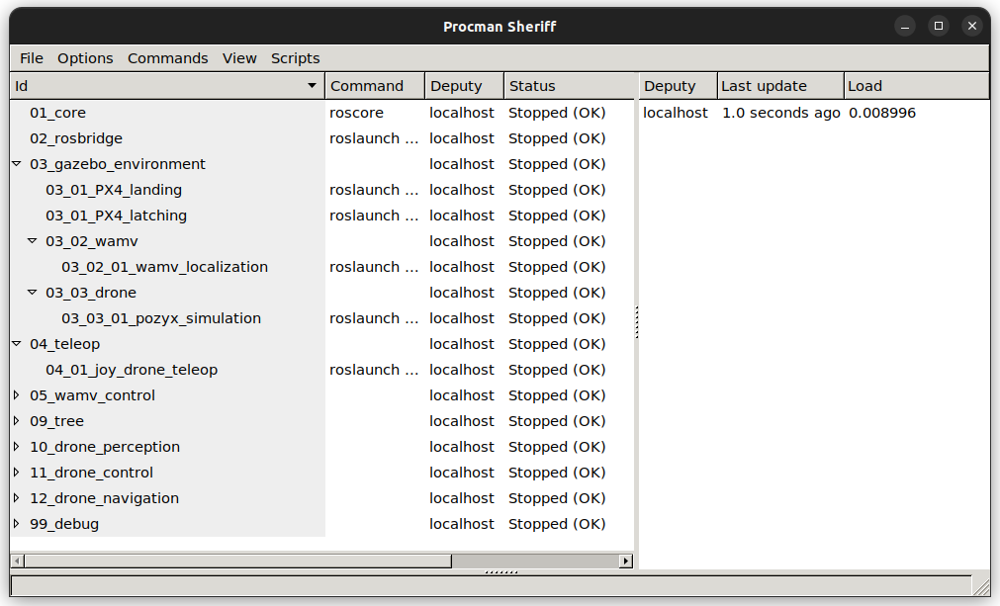
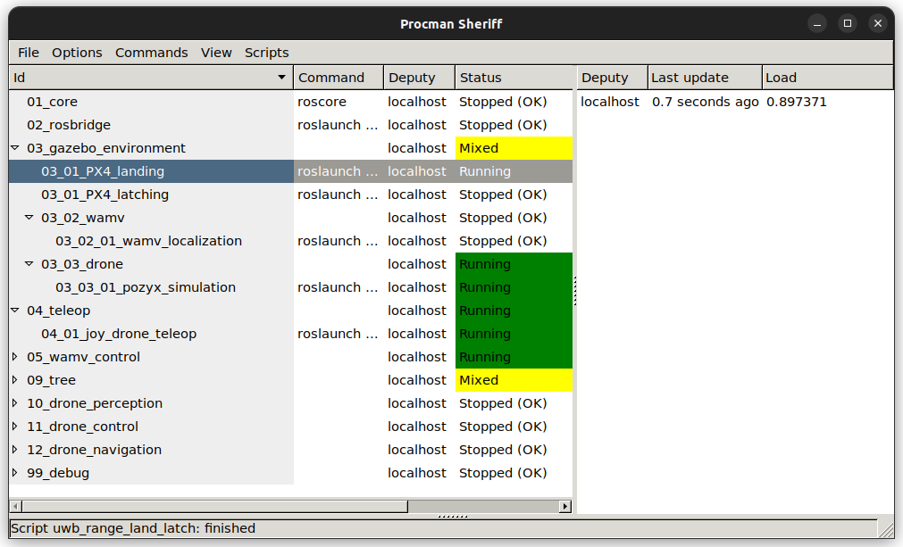
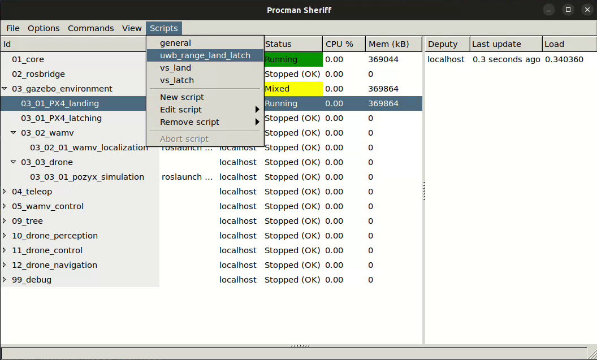
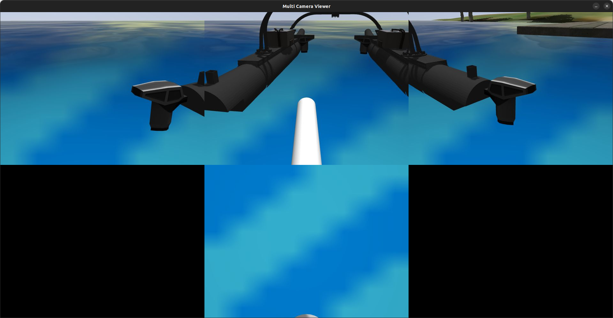

# UAV Land or Latch on USV using UWB

## Introduction

This document describes the process of landing a UAV on a USV using UWB distance signature. The UAV will use the UWB distance signature to land on the USV. The USV will be moving in a circular path and the UAV will land on the USV using the UWB distance signature.

## Environment Setup

### 1. Clone the repo

```sh
git clone --recursive git@github.com:ARG-NCTU/robotx-2022.git
```

### 2. Run Docker

```
cd robotx-2022
source ipc_run.sh
```

After start the docker container, please ensure you are in the folder named robotx-2022.

### 3. Build the catkin workspace

This will build the `catkin_ws` and setup `PX4-Autopilot`.

```
source build_all.sh
```

### 4. Setup the environment

```
source scripts/00_setup_all.sh
```

### 5. Launch the procman

```
make drone_uwb_px4
```



### 6. Start the gazebo

For land task, start `03_01_PX4_landing`

For latch task, start `03_01_PX4_latching`



### 7. Start the script "uwb_range_land_latch"



### 8. Manual Control drone

Use F710 joystick on both D mode and X mode.

Use X to arm the drone. Push the left stick to the top to take off the drone.

The left stick is used to control the drone's height and rotation. The right stick is used to control the horizontal direction of the drone.


### 8. Run docker container `ubuntu-20.04` and run tracking and landing script

```
source Docker/ubuntu-20.04/run.bash
cd catkin_ws/src/drone_controller/src/
python3 track_wamv_uwb_range.py
python3 land_wamv_uwb_range.py
```

### 9. Ready to land or latch

Press LOGO button, now the drone will track behind the USV.



Press left stick buttom, the USV start to move in a circular path and the drone start to land on the USV.

If need to manual land, press the LB button to takeover the control.